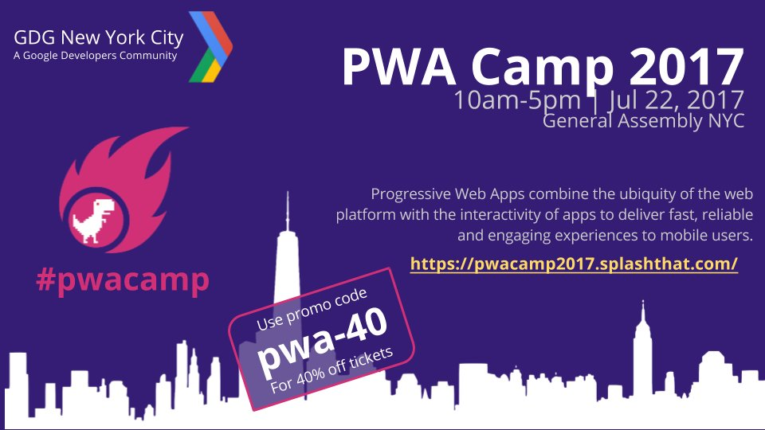

# Progressive Web Apps Camp

[PWA Camp 2017](https://pwacamp2017.splashthat.com/) | [GDG Meetup Page](https://www.meetup.com/gdgnyc/events/240538942/)

### About the Event

**Overview:** Progressive Web Apps Camp (PWA Camp) is one of a series of "Study Camps" designed to jumpstart deeper understanding of a technology through a combination of talks and hands-on codelabs in a community setting. Think of this as "base camp" for an expedition that can then be continued through regular online interactions and in-person events where you can progressively gain depth of experience through collective sharing and discussion.

PWA Camp 2017 is structured in three stages to provide a 360-degree view of the space. First, we begin with the Principles session where we cover the core concepts and tools associated with PWA development. Next we have the Programming session with instructor-led tutorials on developing PWA on specific platforms or frameworks followed by a self-guided codelabs segment where you will learn to build & deploy a PWA on your own. Finally, we have the Practices session where we hear from experts about best practices for deploying PWA in real world and production environments.

**What You'll Take Away:** Attendees can expect to get a 360 view of PWA from understanding core concepts to getting hands-on training (with codelabs) and finally getting industry insights on usage in real-world environments

**Why It's Important:** The mobile web is increasingly important for connecting users to information anywhere, from any device. PWA allows web apps to be architected to have better performance across diverse platforms and under resource constraints (e.g., intermittent connectivity) by embodying the core principles of 'progressive enhancement'. PWAs also help web developers craft applications that are more comparable to their native counterparts, making them easier (and more familiar) to consume by mobile users.

### Partners and Sponsors

* Google Developer Group: New York
* Pluralsight
* JetBrains
* O'Reilly
* Manning
* General Assembly
